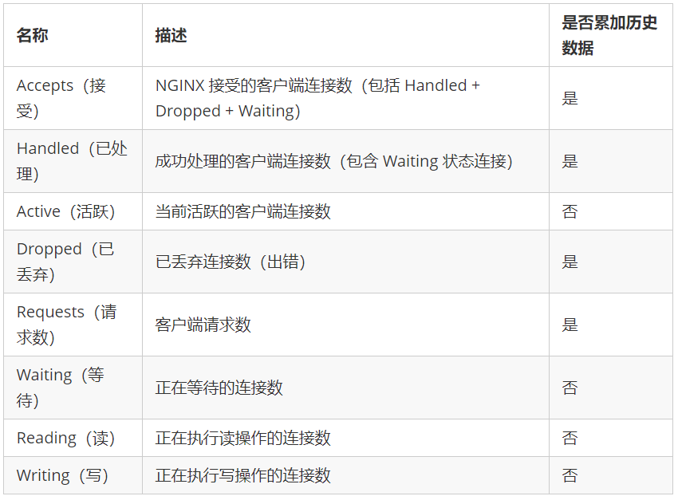

# Nginx 变量


Nginx 同 Apache 等其他 Web 服务器的配置记法不太相同，Nginx的配置文件使用语法的就是一门微型的编程语言。可以类似写程序一般编写配置文件，可操作性很大。既然是编程语言，一般也就少不了“变量”这种概念。


​    Nginx变量简介

-  所有的 Nginx变量在 Nginx 配置文件中引用时都须带上 $ 前缀 
-  在 Nginx 配置中，变量只能存放一种类型的值，有且也只存在一种类型，那就是字符串类型 
-  nginx可以使用变量简化配置与提高配置的灵活性，所有的变量值都可以通过这种方式引用： 

```shell
$变量名
```


nginx中的变量分为两种，自定义变量与内置预定义变量

### 1、自定义变量

1、声明变量

可以在sever,http,location等标签中使用set命令（非唯一）声明变量，语法如下 

```shell
set $变量名 变量值
```


注意: 

- nginx 中的变量必须都以$开头
- nginx 的配置文件中所有使用的变量都必须是声明过的，否则 nginx 会无法启动并打印相关异常日志

**2、变量的可见性**

在不同层级的标签中声明的变量性的可见性规则如下:

- location标签中声明的变量中对这个location块可见
- server标签中声明的变量对server块以及server块中的所有子块可见
- http标签中声明的变量对http块以及http块中的所有子块可见


**nginx安装echo模块**

```shell
查看已经安装的nginx的版本
[root@192 ~]# nginx -V 
下载echo模块的安装包
[root@192 ~]# wget https://github.com/openresty/echo-nginx-module/archive/v0.61.tar.gz
[root@192 ~]# ls
anaconda-ks.cfg  nginx-1.16.0.tar.gz  v0.61.tar.gz
解压到相同路径下:
[root@192 ~]# tar xzf nginx-1.16.0.tar.gz -C /usr/local/
[root@192 ~]# tar xzf v0.61.tar.gz -C /usr/local/
安装编译工具
[root@192 ~]# cd /usr/local/
[root@192 local]# yum -y install pcre pcre-devel openssl openssl-devel gcc gcc-c++   zlib zlib-devel
添加模块：
[root@192 local]# cd nginx-1.16.0/
添加上原来已经有的参数和新添加的模块:
[root@192 nginx-1.16.0]# ./configure --prefix=/etc/nginx --sbin-path=/usr/sbin/nginx --modules-path=/usr/lib64/nginx/modules --conf-path=/etc/nginx/nginx.conf --error-log-path=/var/log/nginx/error.log --http-log-path=/var/log/nginx/access.log --pid-path=/var/run/nginx.pid --lock-path=/var/run/nginx.lock --http-client-body-temp-path=/var/cache/nginx/client_temp --http-proxy-temp-path=/var/cache/nginx/proxy_temp --http-fastcgi-temp-path=/var/cache/nginx/fastcgi_temp --http-uwsgi-temp-path=/var/cache/nginx/uwsgi_temp --http-scgi-temp-path=/var/cache/nginx/scgi_temp --user=nginx --group=nginx --with-compat --with-file-aio --with-threads --with-http_addition_module --with-http_auth_request_module --with-http_dav_module --with-http_flv_module --with-http_gunzip_module --with-http_gzip_static_module --with-http_mp4_module --with-http_random_index_module --with-http_realip_module --with-http_secure_link_module --with-http_slice_module --with-http_ssl_module --with-http_stub_status_module --with-http_sub_module --with-http_v2_module --with-mail --with-mail_ssl_module --with-stream --with-stream_realip_module --with-stream_ssl_module --with-stream_ssl_preread_module --with-cc-opt='-O2 -g -pipe -Wall -Wp,-D_FORTIFY_SOURCE=2 -fexceptions -fstack-protector-strong --param=ssp-buffer-size=4 -grecord-gcc-switches -m64 -mtune=generic -fPIC' --with-ld-opt='-Wl,-z,relro -Wl,-z,now -pie' --add-module=/usr/local/echo-nginx-module-0.61
[root@192 nginx-1.16.0]# make   #编译，不要make install 否则会覆盖原来的文件
[root@192 nginx-1.16.0]#  mv /usr/local/nginx/sbin/nginx /usr/local/nginx/sbin/nginx_bak2 #将原来的nignx备份
[root@192 nginx-1.16.0]# cp objs/nginx /usr/local/nginx/sbin/  拷贝nignx
[root@192 nginx-1.16.0]# /usr/local/nginx/sbin/nginx  #启动
[root@192 nginx-1.16.0]# nginx -V  查看模块是否添加成功
nginx version: nginx/1.16.0
built by gcc 4.8.5 20150623 (Red Hat 4.8.5-36) (GCC) 
built with OpenSSL 1.0.2k-fips  26 Jan 2017
TLS SNI support enabled
configure arguments: --prefix=/etc/nginx --sbin-path=/usr/sbin/nginx --modules-path=/usr/lib64/nginx/modules --conf-path=/etc/nginx/nginx.conf --error-log-path=/var/log/nginx/error.log --http-log-path=/var/log/nginx/access.log --pid-path=/var/run/nginx.pid --lock-path=/var/run/nginx.lock --http-client-body-temp-path=/var/cache/nginx/client_temp --http-proxy-temp-path=/var/cache/nginx/proxy_temp --http-fastcgi-temp-path=/var/cache/nginx/fastcgi_temp --http-uwsgi-temp-path=/var/cache/nginx/uwsgi_temp --http-scgi-temp-path=/var/cache/nginx/scgi_temp --user=nginx --group=nginx --with-compat --with-file-aio --with-threads --with-http_addition_module --with-http_auth_request_module --with-http_dav_module --with-http_flv_module --with-http_gunzip_module --with-http_gzip_static_module --with-http_mp4_module --with-http_random_index_module --with-http_realip_module --with-http_secure_link_module --with-http_slice_module --with-http_ssl_module --with-http_stub_status_module --with-http_sub_module --with-http_v2_module --with-mail --with-mail_ssl_module --with-stream --with-stream_realip_module --with-stream_ssl_module --with-stream_ssl_preread_module --with-cc-opt='-O2 -g -pipe -Wall -Wp,-D_FORTIFY_SOURCE=2 -fexceptions -fstack-protector-strong --param=ssp-buffer-size=4 -grecord-gcc-switches -m64 -mtune=generic -fPIC' --with-ld-opt='-Wl,-z,relro -Wl,-z,now -pie' --add-module=/usr/local/echo-nginx-module-0.61
```

**3、配置 $foo=hello**


```shell
[root@192 ~]# cd /etc/nginx/conf.d/
[root@192 conf.d]# vim echo.conf
server {
        listen 80;
        server_name     localhost;
        location /test {
                set $foo hello;
                echo "foo: $foo";
        }
}
```


输出


```shell
[root@192 conf.d]# nginx -s reload
[root@192 conf.d]# curl localhost/test
foo: hello
```


**5、 使用大括号插值**


在“变量插值”的上下文中，还有一种特殊情况，即当引用的变量名之后紧跟着变量名的构成字符时（比如后跟字母、数字以及下划线），我们就需要使用特别的记法来消除歧义，例如：


```shell
server {
        listen 80;
        server_name     localhost;
        location /test-brace {
                set $first "hello ";
                echo "${first}world";
        }
}
或者
server {
        listen 80;
        server_name     localhost;
        location /test-brace {
                set $first "hello";
                echo "$first world";
        }
}
```


输出


```shell
[root@192 conf.d]# nginx -s reload 
[root@192 conf.d]# curl localhost/test-brace
hello world
```


这里，我们在 echo 配置指令的参数值中引用变量 first 的时候，后面紧跟着 world 这个单词，所以如果直接写作 "firstworld" 则 Nginx “变量插值”计算引擎会将之识别为引用了变量 firstworld. 为了解决这个难题，Nginx 的字符串记法支持使用花括号在  之后把变量名围起来，比如这里的 ${first}。


**6、变量作用域**


set 指令不仅有赋值的功能，它还有创建 Nginx 变量的作用，即当作为赋值对象的变量尚不存在时，它会自动创建该变量。如果我们不创建就直接使用它的值，则会报错。
例如


```shell
server {
    ...
    location /bad {
        echo $foo;
    }
}
```


此时 Nginx 服务器会拒绝加载配置：


```shell
[root@192 conf.d]# nginx -s reload 
nginx: [emerg] unknown "foo" variable
nginx: configuration file /etc/nginx/nginx.conf test failed
```


Nginx 变量的创建和赋值操作发生在全然不同的时间阶段，Nginx 变量的创建只能发生在 Nginx 配置加载的时候，或者说 Nginx 启动的时候，而赋值操作则只会发生在请求实际处理的时候。
这意味着不创建而直接使用变量会导致启动失败，同时也意味着我们无法在请求处理时动态地创建新的 Nginx 变量。


Nginx 变量一旦创建，其变量名的可见范围就是整个 Nginx 配置，甚至可以跨越不同虚拟主机的 server 配置块。我们来看一个例子：


```shell
server {
        listen 80;
        server_name     localhost;
        location /foo {
                echo "foo = [$foo]";
        }
        location /bar {
                set $foo 32;
                echo "foo = [$foo]";
        }
}
```


输出


```shell
[root@192 conf.d]# curl 'http://localhost/foo'
foo = []
[root@192 conf.d]# curl 'http://localhost/bar'
foo = [32]
```


这里我们在 location /bar 中用 set 指令创建了变量 foo，于是在整个配置文件中这个变量都是可见的，因此我们可以在 location /foo 中直接引用这个变量而不用担心 Nginx 会报错。
从这个例子我们可以看到，set 指令因为是在 location /bar 中使用的，所以赋值操作只会在访问 /bar 的请求中执行。而请求 /foo 接口时，我们总是得到空的 foo值，因为用户变量未赋值就输出的话，得到的便是空字符串。


从这个例子我们可以窥见的另一个重要特性是，Nginx 变量名的可见范围虽然是整个配置，但每个请求都有所有变量的独立副本，或者说都有各变量用来存放值的容器的独立副本，彼此互不干扰。比如前面我们请求了 /bar 接口后，foo 变量被赋予了值 32，但它丝毫不会影响后续对 /foo 接口的请求所对应的 foo 值（它仍然是空的！），因为各个请求都有自己独立的 $foo 变量的副本。


### 2、内置预定义变量


内置预定义变量即无需声明就可以使用的变量，通常包括一个http请求或响应中一部分内容的值，以下为一些常用的内置预定义变量。

| **变量名**          | **定义**                                                     |
| ------------------- | ------------------------------------------------------------ |
| $arg_PARAMETER      | GET请求中变量名PARAMETER参数的值。                           |
| $args               | 这个变量等于GET请求中的参数。例如，foo=123&bar=blahblah;这个变量只可以被修改 |
| $binary_remote_addr | 二进制码形式的客户端地址。                                   |
| $body_bytes_sent    | 传送页面的字节数                                             |
| $content_length     | 请求头中的Content-length字段。                               |
| $content_type       | 请求头中的Content-Type字段。                                 |
| $cookie_COOKIE      | cookie COOKIE的值。                                          |
| $document_root      | 当前请求在root指令中指定的值。                               |
| $document_uri       | 与$uri相同。                                                 |
| $host               | 请求中的主机头(Host)字段，如果请求中的主机头不可用或者空，则为处理请求的server名称(处理请求的server的server_name指令的值)。值为小写，不包含端口。 |
| $hostname           | 机器名使用 gethostname系统调用的值                           |
| $http_HEADER        | HTTP请求头中的内容，HEADER为HTTP请求中的内容转为小写，-变为_(破折号变为下划线)，例如：$http_user_agent(Uaer-Agent的值); |
| $sent_http_HEADER   | HTTP响应头中的内容，HEADER为HTTP响应中的内容转为小写，-变为_(破折号变为下划线)，例如： $sent_http_cache_control, $sent_http_content_type…; |
| $is_args            | 如果$args设置，值为"?"，否则为""。                           |
| $limit_rate         | 这个变量可以限制连接速率。                                   |
| $nginx_version      | 当前运行的nginx版本号。                                      |
| $query_string       | 与$args相同。                                                |
| $remote_addr        | 客户端的IP地址。                                             |
| $remote_port        | 客户端的端口。                                               |
| $remote_user        | 已经经过Auth Basic Module验证的用户名。                      |
| $request_filename   | 当前连接请求的文件路径，由root或alias指令与URI请求生成。     |
| $request_body       | 这个变量（0.7.58+）包含请求的主要信息。在使用proxy_pass或fastcgi_pass指令的location中比较有意义。 |
| $request_body_file  | 客户端请求主体信息的临时文件名。                             |
| $request_completion | 如果请求成功，设为"OK"；如果请求未完成或者不是一系列请求中最后一部分则设为空。 |
| $request_method     | 这个变量是客户端请求的动作，通常为GET或POST。包括0.8.20及之前的版本中，这个变量总为main request中的动作，如果当前请求是一个子请求，并不使用这个当前请求的动作。 |
| $request_uri        | 这个变量等于包含一些客户端请求参数的原始URI，它无法修改，请查看$uri更改或重写URI。 |
| $scheme             | 所用的协议，比如http或者是https，比如rewrite ^(.+)$ $scheme://example.com$1 redirect; |
| $server_addr        | 服务器地址，在完成一次系统调用后可以确定这个值，如果要绕开系统调用，则必须在listen中指定地址并且使用bind参数。 |
| $server_name        | 服务器名称。                                                 |
| $server_port        | 请求到达服务器的端口号。                                     |
| $server_protocol    | 请求使用的协议，通常是HTTP/1.0或HTTP/1.1。                   |
| $uri                | 请求中的当前URI(不带请求参数，参数位于args，不同于浏览器传递的args)，不同于浏览器传递的request_uri的值，它可以通过内部重定向，或者使用index指令进行修改。不包括协议和主机名，例如/foo/bar.html |


Nginx 内置变量最常见的用途就是获取关于请求或响应的各种信息。


**1、uri  vs request_uri**


由 ngx_http_core 模块提供的内建变量 uri，可以用来获取当前请求的 URI（不含请求参数），
而 request_uri 则用来获取请求最原始的 URI（包含请求参数）。


```shell
server {
        listen 80;
  
        server_name     localhost;
        location /test-uri {
                echo "uri = $uri";
                echo "request_uri = $request_uri";
        }
}
```


输出


```shell
[root@192 conf.d]# nginx -s reload 
[root@192 conf.d]# curl localhost/test-uri
uri = /test-uri
request_uri = /test-uri
再次访问，加入参数
[root@192 conf.d]# curl "localhost/test-uri?a=3&b=4"
uri = /test-uri
request_uri = /test-uri?a=3&b=4
[root@192 conf.d]# curl "localhost/test-uri/hello%20world?a=3&b=4"
uri = /test-uri/hello world
request_uri = /test-uri/hello%20world?a=3&b=4
```


**2、$arg_XXX**


另一个特别常用的内建变量其实并不是单独一个变量，而是有无限多变种的一群变量，即名字以 arg_ 开头的所有变量，我们估且称之为 arg_XXX 变量群。
一个例子是 arg_name，这个变量的值是当前请求中名为 name 的参数的值，而且还是未解码的原始形式的值。


```shell
server {
        listen 80;
        server_name     localhost;
        location /test-arg {
        echo "name: $arg_name";
        echo "class: $arg_class";
        }
}
```


输出


```shell
[root@192 conf.d]# nginx -s reload
[root@192 conf.d]# curl localhost/test-arg
name: 
class: 

[root@192 conf.d]# curl "localhost/test-arg?name=Tom&class=3"
name: Tom
class: 3

[root@192 conf.d]# curl "localhost/test-arg?name=hello%20world&class=9"
name: hello%20world
class: 9
```


**3、$arg_XXX 不区分大小写**


其实 $arg_name 不仅可以匹配 name 参数，也可以匹配 NAME 参数，抑或是 Name，Nginx 会在匹配参数名之前，自动把原始请求中的参数名调整为全部小写的形式。


```shell
[root@192 conf.d]# curl "localhost/test-arg?NAME=Marry"
name: Marry
class: 
[root@192 conf.d]# curl "localhost/test-arg?Name=Jimmy&class=DSfef"
name: Jimmy
class: DSfef
```


# Nginx 监控


### 1、Nginx的基础监控

- 进程监控
- 端口监控


注意： 

这两个是必须要加在Zabbix监控，加触发器有问题及时告警。

web 服务器 nginx 以其高性能与抗并发能力越来越多的被用户使用

Nginx 提供了 ngx_http_stub_status_module，ngx_http_reqstat_module模块，这个模块提供了基本的监控功能


作为官方企业版的 nginx plus 通过 ngx_http_status_module 提供了更加完善的监控功能: http://demo.nginx.com/status.html

### 2、监控的主要指标


我们需要对以下主要的指标进行监控：


#### 1、基本活跃指标


Accepts（接受）、Handled（已处理）、Requests（请求数）是一直在增加的计数器。Active（活跃）


| 名称                        | 描述                          | 指标类型     |
| --------------------------- | ----------------------------- | ------------ |
| Accepts（接受）             | NGINX 所接受的客户端连接数    | 资源: 功能   |
| Handled（已处理）           | 成功的客户端连接数            | 资源: 功能   |
| Dropped（已丢弃，计算得出） | 丢弃的连接数（接受 - 已处理） | 工作：错误*  |
| Requests（请求数）          | 客户端请求数                  | 工作：吞吐量 |


#### 2、每秒请求数 -- QPS

按照固定时间间隔采样请求数据，计算出单位时间的请求量可以看到你的 web 服务器的请求情况

通过持续的 QPS 监控，可以立刻发现是否被恶意攻击或对服务的可用性进行评估。


虽然当问题发生时，通过 QPS 不能定位到确切问题的位置，但是他却可以在第一时间提醒你环境可能出问题了


#### 3、服务器错误率

通过监控固定时间间隔内的错误代码（4XX代码表示客户端错误，5XX代码表示服务器端错误），可以了解到客户端收到的结果是否是正确的错误率突然的飙升很可能是你的网站漏洞发出的信号


如果你希望通过 access_log 分析错误率，那么你需要配置 nginx 的日志模块，让 nginx 将响应码写入访问日志


#### 4、指标的收集

介绍了这么多的监控指标，事实上，上面介绍的仅仅是基本的监控指标，针对实际的情况，还有很多指标十分具有监控的必要


通过在编译时加入 `nginx` 的 `ngx_http_stub_status_module` 模块我们可以实时监控以下基本的指标：


##### 1、nginx Stub Status 监控模块安装


先使用命令查看是否已经安装这个模块：


```shell
# -V大写会显示版本号和模块等信息、v小写仅显示版本信息
[root@localhost ~]# nginx -V
```


如果没有此模块，需要重新安装，编译命令如下：


```shell
./configure –with-http_stub_status_module
```


具体的使用方法是在执行 ./configure 时，指定 --with-http_stub_status_module，然后通过配置：


```shell
server {
        listen 80;
        server_name localhost;
        location /nginx-status {
                stub_status     on;
                access_log      on;
                }
}
```


##### 2、Nginx 状态查看


配置完成后在浏览器中输入http://10.0.105.207/nginx-status 查看


（或者用 `curl localhost/nginx-status`），显示信息如下：


```shell
Active connections: 2 
server accepts handled requests
 26 26 48 
Reading: 0 Writing: 1 Waiting: 1
```


##### 3、Stub Status 参数说明


正常情况下waiting数量是比较多的，并不能说明性能差。如果reading+writing数量比较多说明服务并发有问题。





Active connections:2   #当前nginx处理请求的数目(活跃的连接数)


server  accepts   handled   requests
26       26         48


nginx总共处理了26个连接，成功创建26次握手，也就是成功的连接数connection.  总共处理了48个请求


失败连接＝（总连接数－成功连接数）(相等表示中间没有失败的)。

每个连接有三种状态waiting、reading、writing；

reading —读取客户端的Header信息数.这个操作只是读取头部信息，读取完后马上进入writing状态，因此时间很短。

writing — 响应数据到客户端的Header信息数.这个操作不仅读取头部，还要等待服务响应，因此时间比较长。

waiting — 开启keep-alive后等候下一次请求指令的驻留连接.

正常情况下waiting数量是比较多的，并不能说明性能差。反而如果reading+writing数量比较多说明服务并发有问题。


当用户请求连接Nginx服务器时，accepts计数器会加一。且当服务器处理该连接请求时，handled计数器同样会加一。一般而言，两者的值是相等的，除非达到了某些资源极限（如worker_connection的限制）。


用户连接请求被处理，就会进入 active 状态。如果该连接没有其他 request，则进入 waiting 的子状态；如果有 request，nginx 会读取 request 的 header，计数器 request 加一，进入 reading 的子状态。 reading 状态持续时间非常短，header 被读取后就会进入 writing 状态。事实上，直到服务器将响应结果返回给用户之前，该连接会一直保持 writing 状态。所以说，writing 状态一般会被长时间占用。


一旦 NGINX 成功处理一个连接时，连接会移动到Active状态，在这里对客户端请求进行处理;

##### 4、Reqstat 模块监控


**描述**

-  ngx_http_reqstat_module 模块 
-  这个模块计算定义的变量，根据变量值分别统计 nginx 的运行状况。 
-  可以监视的运行状况有：连接数、请求数、各种响应码范围的请求数、输入输出流量、rt、upstream访问等。 
-  可以指定获取所有监控结果或者一部分监控结果。 
-  利用变量添加自定义监控状态。总的监控状态最大个数为50个。 
-  回收过期的监控数据。 
-  设置输出格式 
-  跟踪请求，不受内部跳转的影响 
-  不要使用与响应相关的变量作为条件，比如"$status"
  **现在通过**`**ngx_req_status_module**`**能够统计Nginx中请求的状态信息**。需要安装第三方模块 


安装模块:


```shell
tengine官方说req-status模块默认安装。但是并没有。从github引入第三方模块解决该问题
yum与编译安装的nginx扩展模块安装:
[root@nginx-server ~]# yum install -y unzip
1. 安装，先查看一下当前编译安装nginx的版本
[root@localhost nginx-1.16.0]# nginx -V  
下载或者上传一个和当前的nginx版本一样的nginx的tar包。
[root@nginx-server ~]# tar xzf nginx-1.16.0.tar.gz -C /usr/local/
2.下载ngx_req_status_module 模块， 这是第三方模块需要添加
[root@nginx-server ~]# wget https://github.com/zls0424/ngx_req_status/archive/master.zip -O ngx_req_status.zip
[root@nginx-server ~]# unzip ngx_req_status.zip
[root@nginx-server ~]# cp -r ngx_req_status-master/ /usr/local/ #与解压的nginx在同一级目录下
[root@nginx-server ~]# cd /usr/local/nginx-1.16.0/
[root@nginx-server nginx-1.16.0]# yum -y install pcre pcre-devel openssl openssl-devel gcc gcc-c++   zlib zlib-devel
[root@nginx-server nginx-1.16.0]# yum -y install patch.x86_64
[root@nginx-server nginx-1.16.0]# patch -p1 < ../ngx_req_status-master/write_filter-1.7.11.patch
[root@localhost nginx-1.16.0]# ./configure 添加上原来的参数 --add-module=/usr/local/ngx_req_status-master
[root@localhost nginx-1.16.0]# make 
由于原先已有nginx，所以不能执行make install,否则会覆盖掉以前的配置文件及内容
[root@localhost nginx-1.16.0]# mv /usr/sbin/nginx /usr/sbin/nginx_bak
[root@localhost nginx-1.16.0]# cp objs/nginx /usr/sbin/
[root@localhost nginx-1.16.0]# systemctl restart nginx 
[root@localhost nginx-1.16.0]# nginx -V   
如果发现编译的配置文件有变化就成功了！
配置如下: 需要在http里面配置。
[root@localhost ~]# vim /etc/nginx/nginx.conf
req_status_zone server_name $server_name 256k;
req_status_zone server_addr $server_addr 256k;
req_status_zone server_url  $server_name$uri 256k;
req_status server_name server_addr server_url;
server {
		listen 80;
        server_name localhost;
        location /req-status {
        req_status_show on;
        }
}

指令介绍
 req_status_zone
语法: req_status_zone name string size
默认值: None
配置块: http
定义请求状态ZONE,请求按照string分组来排列，例如：
req_status_zone server_url  $server_name$uri 256k;
域名+uri将会形成一条数据，可以看到所有url的带宽，流量，访问数

req_status
语法: req_status zone1[ zone2]
默认值: None
配置块: http, server, location
在location中启用请求状态，你可以指定更多zones。

req_status_show
语法: req_status_show on
默认值: None
配置块: location
在当前位置启用请求状态处理程序
```


请求状态信息包括以下字段：


- zone_name - 利用req_status_zone定义的分组标准。例如，按照服务器名称对请求进行分组后；
- key - 请求按分组标准分组后的分组标识（即组名）。例如按服务器名称分组时，组名可能是localhost；
- max_active - 该组的最大并发连接数；
- max_bw - 该组的最大带宽；
- traffic - 该组的总流量；
- requests - 该组的总请求数；
- active - 该组当前的并发连接数；
- bandwidth - 该组当前带宽。


# 补充(扩展)：

### nginx access log 分析


nginx 的 access log 中可以记录很多有价值的信息，通过分析 access log，可以收集到很多指标


制作nginx的日志切割，每天凌晨切割并压缩。

PV：PV([访问量](https://www.baidu.com/s?wd=访问量&tn=SE_PcZhidaonwhc_ngpagmjz&rsv_dl=gh_pc_zhidao))： 即Page View, 即页面浏览量或[点击量](https://www.baidu.com/s?wd=点击量&tn=SE_PcZhidaonwhc_ngpagmjz&rsv_dl=gh_pc_zhidao)，用户每次刷新即被计算一次。

UV：UV(独立访客)：即Unique Visitor,访问您网站的一台[电脑客户端](https://www.baidu.com/s?wd=电脑客户端&tn=SE_PcZhidaonwhc_ngpagmjz&rsv_dl=gh_pc_zhidao)为一个访客。00:00-24:00内相同的客户端只被计算一次。


**工作常用(面试题笔试):**

找出访问日志所在位置

```plain
find / -name access.log
```

grep命令过滤出当天的,每个访客的访问次数

```shell
cat access.log | grep '2021-03-23' | awk '{print $1}'  | sort | uniq -c | sort -nr -k1 | head -n 10
```


根据访问IP统计UV

```shell
awk '{print $1}'  access.log|sort | uniq -c |wc -l
```


统计访问URL统计PV

```shell
awk '{print $7}' access.log|wc -l
```


查询访问最频繁的URL

```plain
awk '{print $7}' access.log|sort | uniq -c |sort -n -k 1 -r|more

cat /var/log/nginx/access.log |awk '{print $7}'|sort  |uniq -c|sort -n -k 1 -r|awk 'NR==1{print $2}'
```


查询访问最频繁的IP

```plain
awk '{print $1}' access.log|sort | uniq -c |sort -n -k 1 -r|more
```


查询访问最频繁的前10的IP

```shell
awk '{print $1}' access.log|sort | uniq -c |sort -n -k 1 -r|head -n 10
```


6.查询今天下午3:00-4:00，有多少PV？


参考文档：https://blog.csdn.net/weixin_46152207/article/details/115122393